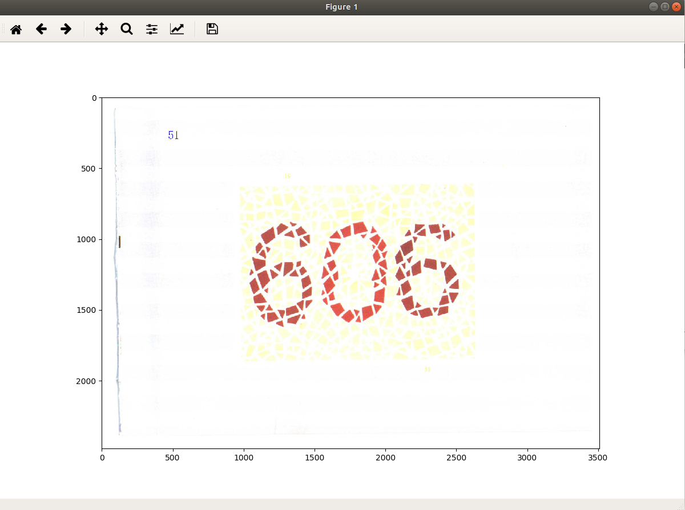
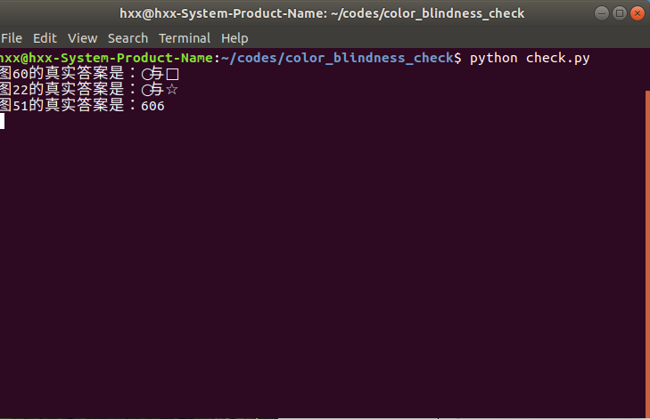

# color_blindness_check(色盲检查)
本代码将我们常用的色盲检查的纸质书编写成了电脑程序，使得我们可以摆脱对专业医学检查书的需求，自己在电脑前就能方便的进行色盲的初步检查。

**申明：该程序最初仅仅为作者自己编写用于自行使用目的的，其不具有专业性与准确性，再加上屏幕显示与医学正规检查图书的颜色差异，此程序不能作为最终检查结果，仅仅作为自查的一个参考。需要专业正规的检查结果，请务必去正规的医院检查。**


## 使用exe程序
下载[smjc.zip](https://github.com/HxxAddoil/color_blindness_check/releases/tag/1.0)，解压缩，然后运行smjc.exe即可。


## 使用源代码

该程序用python3编写，运行前您需要安装：

- python>=3.5
- matplotlib
- Pillow


克隆这个repo：

```shell
$ git clone ...
$ cd color_blindness_check
$ python check.py
```


## 使用说明

运行以后程序会现实一张检查图片和一个命令框，图片的答案显示在命令框里面。

首先，读取显示的图片，得出你的答案；

其次，查看命令框的答案，验证你回答的正确性；

再次，点击图片右上角的 X ，关闭当前图片，进行下一张图片的测试；

最后，关闭命令框可以退出程序。

 

**提示：图片共有65张，随机出图。读图最好在3～5秒内给出答案，最长不能超过10秒。正常色觉的人也有可能读错某些图，偶有读错没关系，如果错的比例很大，则建议去正规医院检查。**
